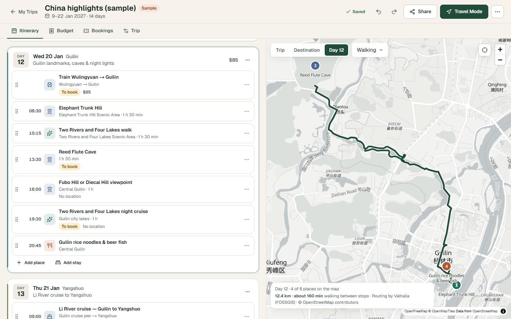
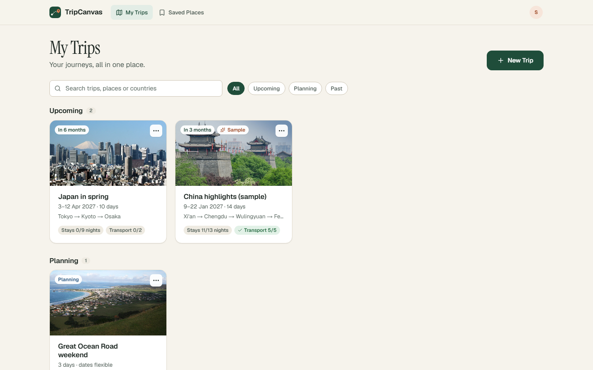
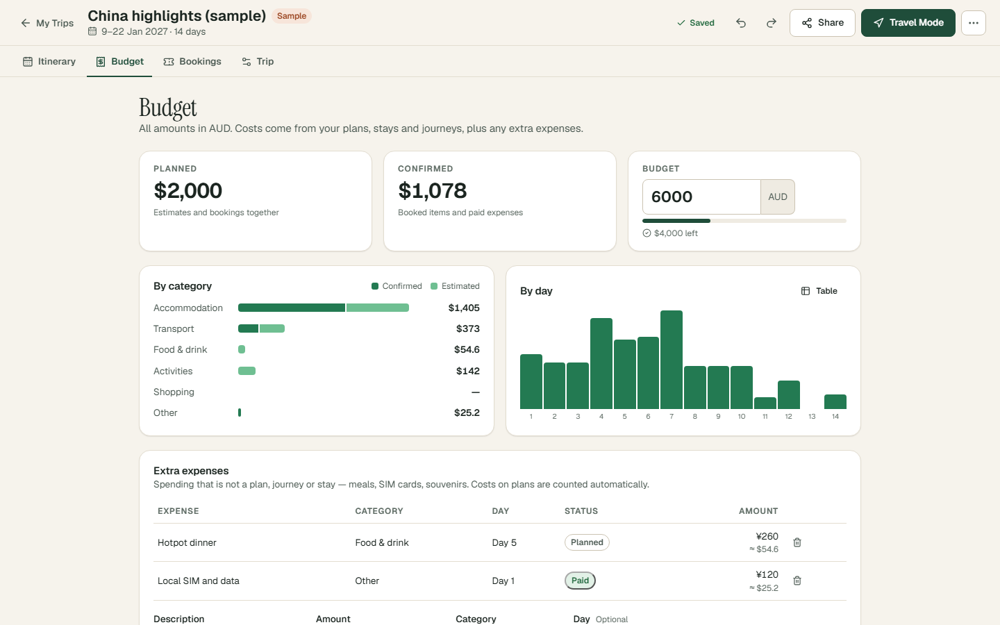
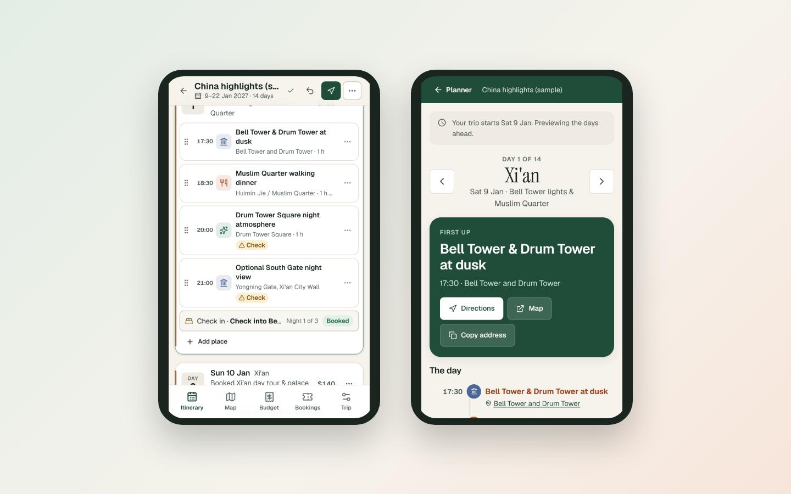

<div align="center">

# TripCanvas

**Your journeys, all in one place.**

Plan a whole trip on one canvas — destinations, day-by-day plans and a live map side by side — keep transport, stays, bookings, documents and budget with it, then take it with you in Travel Mode.



</div>

## What you can do

| | |
|---|---|
| **Plan around the trip** | Add destinations in order and set how many days each gets. Days, dates and map update together; shortening a destination never deletes plans — they move to **Ideas**. |
| **Itinerary + map together** | Each day's places appear on the map with a real walking, cycling or driving route. Click a pin to find the plan, or a plan to find the pin. Trip, destination and day views. |
| **Drag, or don't** | Drag plans between days and Ideas (mouse, touch or keyboard), or use each plan's menu: *Move to day*, *Move up/down*. Undo/redo for everything. |
| **Transport and stays** | Flights, trains, ferries and more, with time zones and overnight arrivals. A stay covers all its nights automatically. |
| **Honest scheduling checks** | Overlaps, transport arriving after the next plan starts, implausible gaps between distant places, double-booked nights, missing stays and connections. Nothing is invented: no fake opening hours or travel times. |
| **Budget and bookings** | Costs live on the item they belong to, so nothing is counted twice. Estimates vs confirmed, by category and by day, multi-currency with recorded exchange rates. Bookings are one view of the same records. |
| **Private documents** | Attach tickets and vouchers (PDF/images, stored privately in R2) to the plan they belong to; they show up again in Travel Mode. |
| **Travel Mode** | Today's plan, what's next, tonight's hotel with call/copy/directions, tickets one tap away — and it keeps working offline once opened. |
| **Reuse and share** | Save days as reusable **sections** ("3 days in Chengdu") and insert them into any trip. Share by email as editor or viewer — enforced on the server. |
| **Assistant (optional)** | Ask Claude to draft or adjust plans. It only *proposes*: every change is listed for review and applied as one undoable step. |
| **Export** | PDF itinerary, calendar file (.ics) and print. |

<p align="center">
  
  
</p>
<p align="center"></p>

## Quick start

Requires **Node.js 22.13+**.

```bash
npm install
npm run dev          # applies local database migrations, then starts http://localhost:3000
```

The development server provides a local D1 database, local R2 file storage and a signed-in test user (`seedy@sites.test`). Open the app, then **Explore a sample trip** on the empty My Trips page to see a 14-day China itinerary.

The optional AI assistant needs an Anthropic API key — see [docs/OPERATIONS.md](docs/OPERATIONS.md#configuration). Everything else works without any keys.

## Quality checks

```bash
npm run typecheck    # TypeScript
npm run lint         # ESLint, zero warnings allowed
npm test             # unit + integration tests (integration runs on a real local D1 via Miniflare)
npm run test:e2e     # Playwright journeys (desktop + mobile) against the dev server
npm run build        # production build for Cloudflare Workers
npm run check        # all of the above except e2e
```

## Project layout

```text
src/
  app/            Pages and API routes (App Router on Vinext)
  components/     UI: ui/ primitives, planner/, map/, trips/, places/, travel/, layout/
  features/       Domain logic: trips (operations, reducer, sync), itinerary checks,
                  budget, sections, assistant proposals, export
  server/         Auth, access control, repository and persistence for D1
  services/       Provider adapters: places, routing, destination info, exchange rates, AI
  db/             Drizzle schema, D1 client, local migration script
  lib/            Small shared helpers (dates, geo, urls, api client)
  styles/         Design tokens and component styles
drizzle/          SQL migrations (shipped with each deploy)
tests/            unit/, integration/, e2e/
docs/             Architecture, operations, audit, roadmap, screenshots
```

## Documentation

- [Architecture](docs/ARCHITECTURE.md) — data model, sync and persistence, providers, security
- [Operations](docs/OPERATIONS.md) — configuration, deployment, migrations, monitoring, backups
- [Product audit](docs/PRODUCT_AUDIT.md) — what the redesign found and fixed
- [Implementation progress](docs/IMPLEMENTATION_PROGRESS.md) — what is done, tested and still open
- [Roadmap](docs/ROADMAP.md)

## Data and attributions

Map tiles © [OpenFreeMap](https://openfreemap.org), © [OpenMapTiles](https://openmaptiles.org), data © [OpenStreetMap](https://www.openstreetmap.org/copyright) contributors. Place search by [Photon](https://photon.komoot.io); routing by [Valhalla](https://valhalla1.openstreetmap.de) (FOSSGIS). Destination photos and introductions from [Wikipedia](https://www.wikipedia.org)/Wikimedia Commons. Exchange rates by [ExchangeRate-API](https://www.exchangerate-api.com). These are free public services with fair-use policies; see [Operations](docs/OPERATIONS.md#providers) before running at scale.
